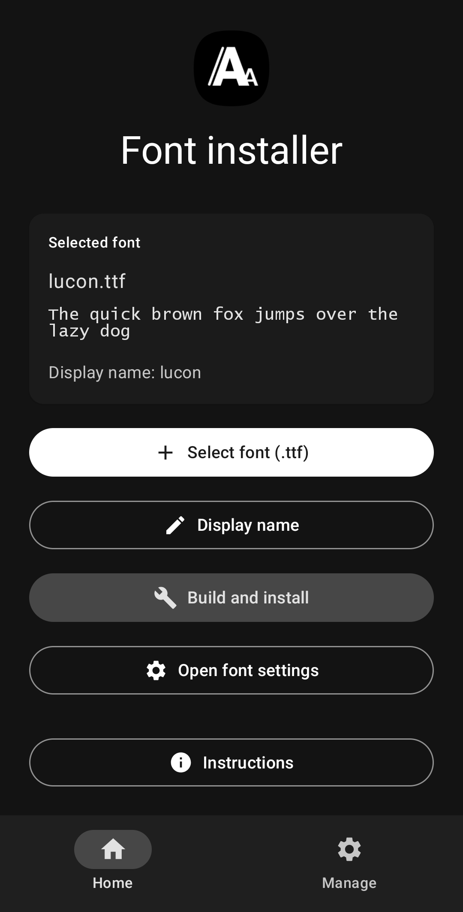
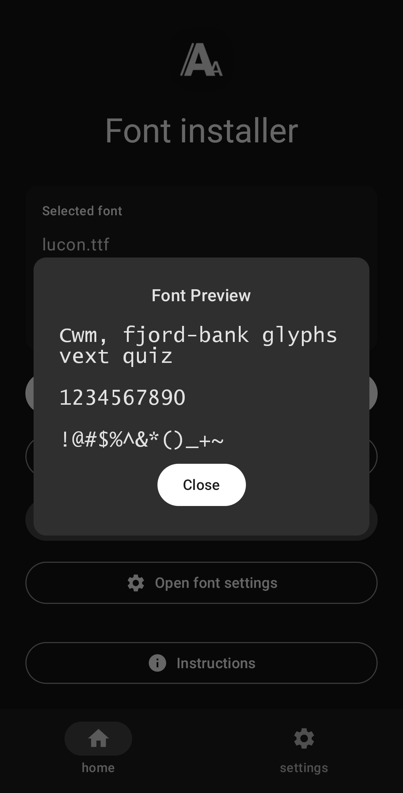
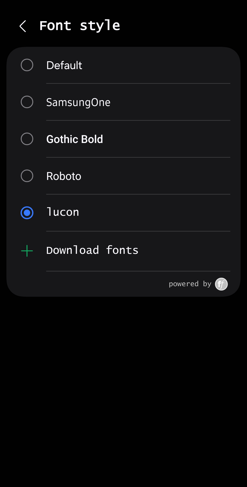

## Fonts manager

> [!IMPORTANT]  
> This app has been put under maintenance-only mode. I no longer own a Samsung device to guarantee it will work. 

  
  
  
  

    
  
  

  

<!-- whelp looks like we gotta make a proper readme, maybe focus on making a proper app too lol -->

Install fonts on One UI 8 without root

It's like zFont, but if it was ad-free, open source, heavily limited, offline and completely manual. And only supported Samsung One UI 8. Cool!

It can:
- install fonts (ttf only)
- uninstall fonts (le gasp)
- preview fonts (woah getting dizzy from the features)
- use shizuku (not required but simplifies installs)

It can't:
- work on anything prior to One UI 8 or non-samsung phones
- fold your dishes
- wash your cat

It won't:
- support anything other than One UI 8 (not planned)

(cat washing support is planned™ /s /j)