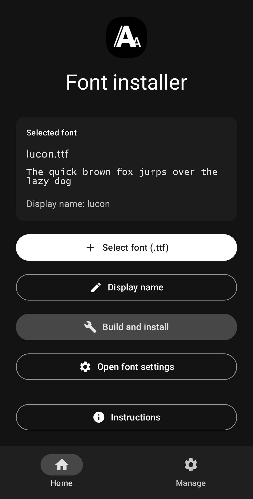
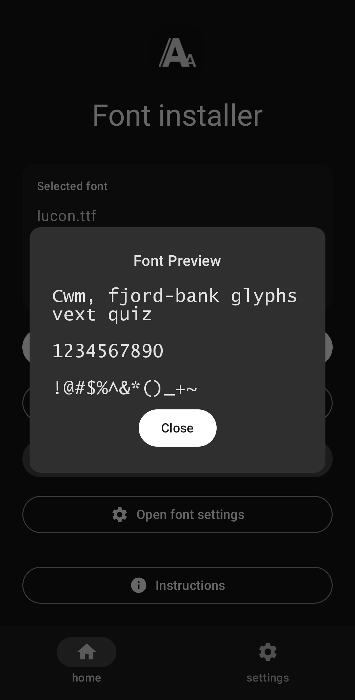
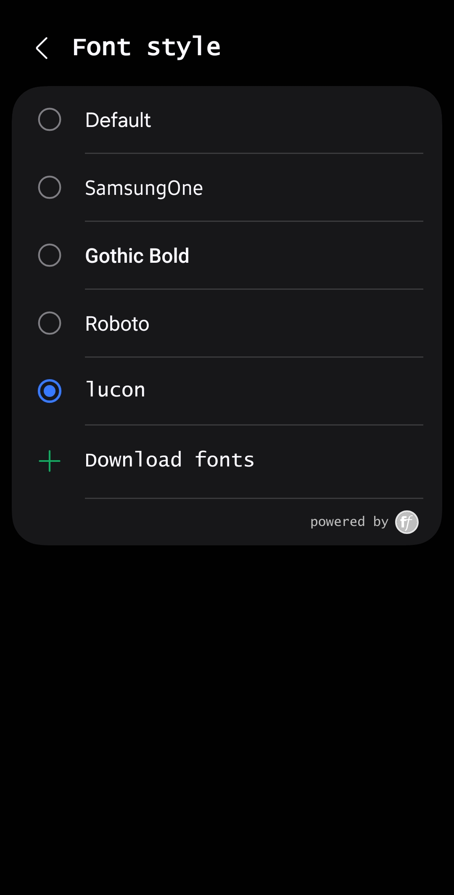

## Fonts manager

> [!IMPORTANT]
> This app has been put under low-maintenance. I no longer own a Samsung device to guarantee it will work. 

> [!WARNING]
> This does not work on One UI 8.5.

<table>
<tr>
<td>

</tr>
</table>

  

  

Install fonts on One UI 8 without root

supports shizuku